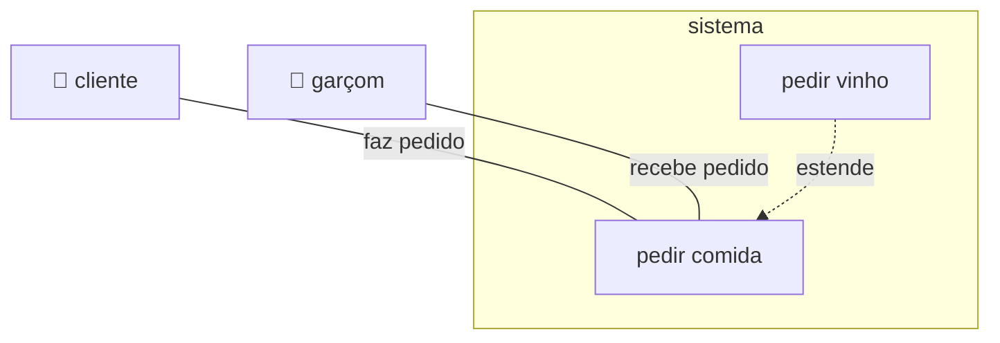

# trabalho-engenharia-software-2026
Trabalho de clínica veterinária do Técnico em Informática, segundo semestre de 2026.

## Diagrama UML

```mermaid
flowchart TD
    %% atores
    cliente["🧑 cliente"]
    garçom["🤵 garçom"]

    %% ações
    subgraph sistema
        comida["pedir comida"]
        vinho["pedir vinho"]
    end

    %% relacionamentos
    cliente -- "faz pedido" --- comida
    garçom -- "recebe pedido" --- comida

    vinho -. "estende" .-> comida
```
